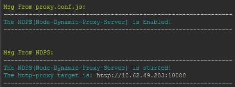
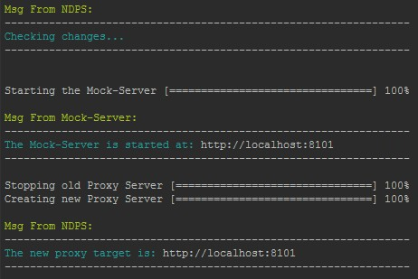
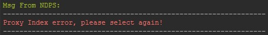
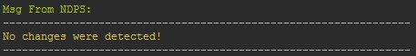

# NDPS(node-dynamic-proxy-server)

### Brief intro
在一个比较大的Angular项目中，开发和测试的环境往往都会有很多。所以在Angular前端的开发过程中，有时需要经常性的切换后端环境。

在angular-cli工程和webpack工程中都提供了修改的方法： 
- 在angular-cli工程中使用指令ng server -pc proxy.conf.json(.js)就能传入一个环境代理配置
- 在webpack工程中则可以在webpack.config.js中通过配置devServer的proxy来实现。

但是，不论是angular-cli工程还是webpack工程，在开发模式下每次更换代理往往都需要重新start工程来使代理生效，而重新start就意味着一个webpack compile的过程，这对一个大型Angular工程来说时间开消是很大的，严重影响开发效率。
有没有一种办法，能让Angular工程在更改完http代理后不需要重新start就能自动生效呢？ 这时候NDPS(node-dynamic-proxy-serve)就能派上用场了！
NDPS(Node-Dynamic-Proxy-Server)是一个基于nodeJS的动态代理服务器，如果在npm start前启用了NDPS，Angular-cli内置的dev-server的目标代理(proxyTarget)就会被设定到NDPS(http://localhost:8181),
此时，NDPS则会读取和监听上面的环境配置，并根据配置的把http请求转发到对应的后端服务器上。
这样做的主要好处是方便Start后需要更换后端环境的场景，NDPS可以在start的状态下动态切换环境，避免了重新运行npm start的时间消耗。

### Quick start
**Make sure you have Node version >= 6.0 and NPM >= 3**

```bash
# Install
$ npm install --save-dev ndps

# Config
> package.json
------------------------------------------------------------------
{
  ...
  "scripts": {
    "start": "npm-run-all -p proxy server",
    "server": ng serve -pc proxy.conf.js
    "proxy": "node proxy.conf.js",
    "mock": "node ./src/mock/mock.js",
    "ndps": "node proxy.conf.js ndps"
    ...
  }
  ...
}

> proxy.conf.js
------------------------------------------------------------------
// Set proxies
/*proxies*/
var proxies = {
  0: 'http://localhost:8101',
  1: 'http://10.93.128.155:10080',
  2: 'http://10.62.107.136:10080',
  ...
};
/*proxies*/

// Set proxy target
var proxyTarget = proxies[ 0 ];

// Config NDPS
var ndpsConf = {
  ndpsPort: 8181,
  mockServerIdx: 0,
  proxiesAnchor: '/*proxies*/',
  proxyIdxAnchor: 'proxies[',
  proxyConfPath: path.join(__dirname, 'proxy.conf.js'),
  mockServerPath: path.join(__dirname, 'src/mock/mock.js')
};

// Config proxy
var proxyConf = [{
  context: ["/api"],
  target: proxyTarget,
  secure: false
}];

// Start NDPS
 require('ndps')(ndpsConf);
 
// Export Conf
module.exports = proxyConf;
```

### Effect pictures
Start NDPS:<br>
<br>
Change proxy target:<br>
<br>
Some other case:<br>
<br>


### License
 [MIT](/LICENSE)
